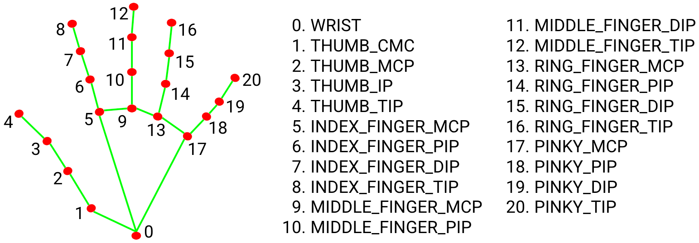

# mediapipe_hand
mediapipe developed by Google is a useful library for detecting the target objects 
including hands, faces, iris, pose...

This repository shows how mediapipe can be used to recognize the two-dimensional coordinates (X and Y axes) of a 21-point hand skeleton.

# How to install mediapipe

tensorflow and opencv library must be installed before installing mediapipe.

$ pip install tensorflow

$ pip install opencv-python

$ pip install mediapipe

# How to run finger.py

A right hand can be detected and 2D (x,y) coordinates of 21 points of 
five fingers can be recognized:

handLandmarks[ ][ ] can determine a position of 21 points by the first index and an axis of x or y by the second index.
For example, 
handLandmarks[4][1] indicates Thumb-finger-tip by "4" in x-axis by "1".

handLandmarks[8][2] indicates Index-finger-tip by "8" in y-axis by "2".

What is handLandmarks[20][2]?

$ python finger.py

# Exercises for students

Build a stone-paper-scissors or rock-paper-scissors detection system.

