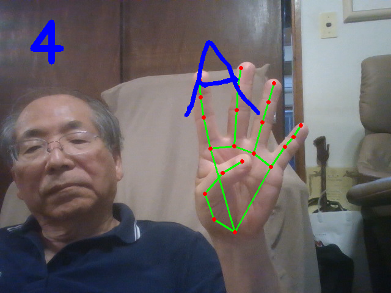
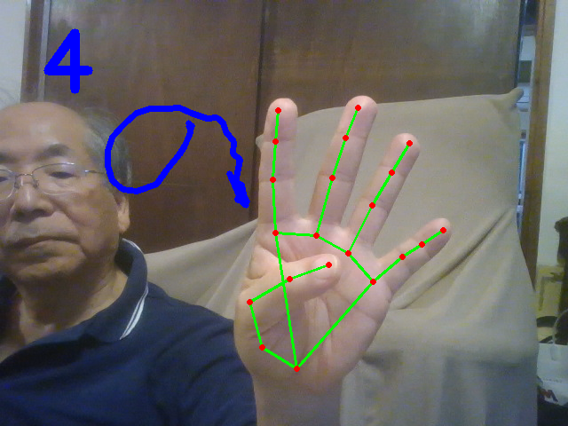
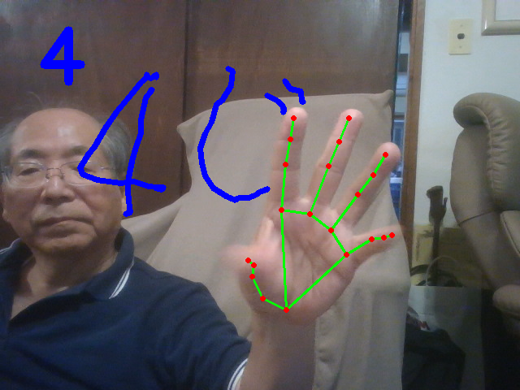
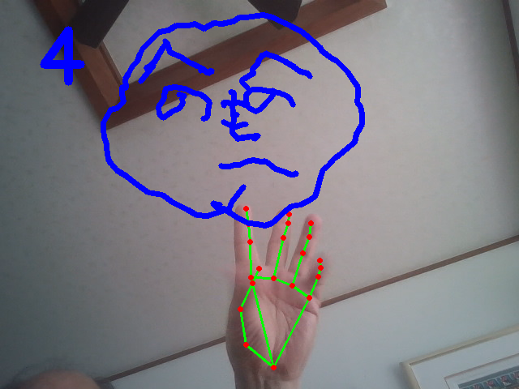
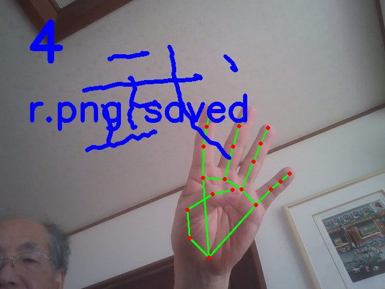
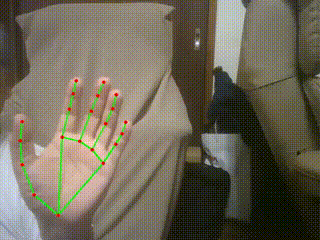
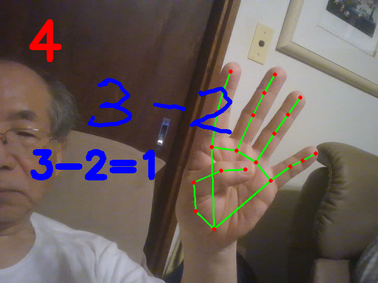
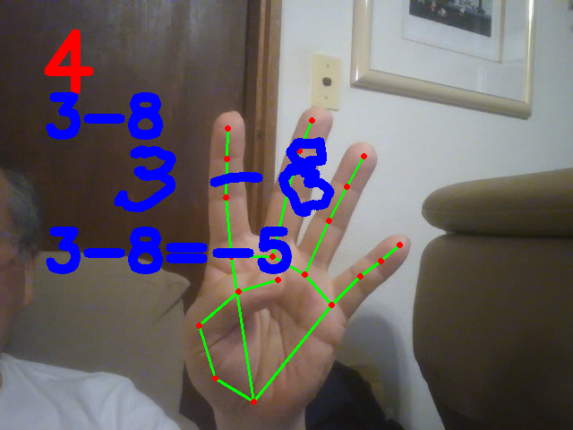
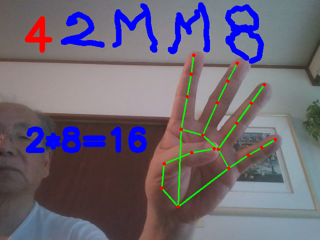

# mediapipe_hand
mediapipe developed by Google is a useful library for detecting the target objects 
including hands, faces, iris, pose...

This repository shows how mediapipe can be used to recognize the two-dimensional coordinates (X and Y axes) of a 21-point hand skeleton.

# How to install mediapipe

tensorflow and opencv library must be installed before installing mediapipe.

$ pip install tensorflow

$ pip install opencv-python

$ pip install mediapipe

# How to run finger.py

A right hand can be detected and 2D (x,y) coordinates of 21 points of 
five fingers can be recognized:

handLandmarks[ ][ ] can determine a position of 21 points by the first index and an axis of x or y by the second index.
For example, 
handLandmarks[4][1] indicates Thumb-finger-tip by "4" in x-axis by "1".

handLandmarks[8][2] indicates Index-finger-tip by "8" in y-axis by "2".

What is handLandmarks[20][2]?

What is handLandmarks[4][3]?

$ python finger.py

# Exercises for students

1.Build a stone-paper-scissors or rock-paper-scissors detection system (Janken recognition).

1.1 recognized hand shape string name (stone, paper or scssors) should be displayed.

1.2 recognized shape (image) should be overlayed on the screen.

Hint is given below using overlay images.

2.Build a finger-gesture counting program.

For example, 050505 => "5" x 3 time

0404040404 -> "4" x5 times

3.Build a drawing-in-the-air program, fingerpic.py .

Hint is given below demos.

# How to overlay two images using cv2
<pre>
Hints:
import cv2
g=cv2.imread('goo.png') 
bg=cv2.imread('background.png')
# locating goo.png on background.png at x=10 and y=20
x=10
y=20
bg[y:y+g.shape[1],x:x+g.shape[0]]=g
cv2.imshow("testing",bg)
cv2.waitKey(1)
</pre>

# how to run fingerpic.py
<pre>
$ python fingerpic.py

One finger draws by index-finger-tip.
Two fingers move the pen without drawing.
Four fingers can save a drawn picture as r.png.
Three fingers can terminate this program.
</pre>

# result
<pre>
Gestures                                saved results
</pre>
 

 

 

 

 

# How to run fingermath.py

fingermath.py is a program for drawing a formula, for example, 4-5.
Drawing the formula by using a single finger. Move a pen by two fingers.
Four fingers can save the formula for calculating it. 
The result will be shown on the screen.
"L" represents "1".
"F" or "5" represents "5".
"P" represents "+" operator.
"W" represents "-" operator.
"V" represents "/" division operator.
"M" represents "*" multiplication operator.

$ python fingermath.py
<pre>
4-5=?                                         3-8=?
</pre>
 

 
<pre>
5-3=?                                          4-5-3=?
</pre>
 
<pre>
2-3-5=?                                        2-3/5=?
</pre>
  
<pre>
 10+2=?                                        34*5=?
</pre>
  
<pre>
67/8=?                                         9-0=?
</pre>
 

<pre> 2**8=? </pre>

